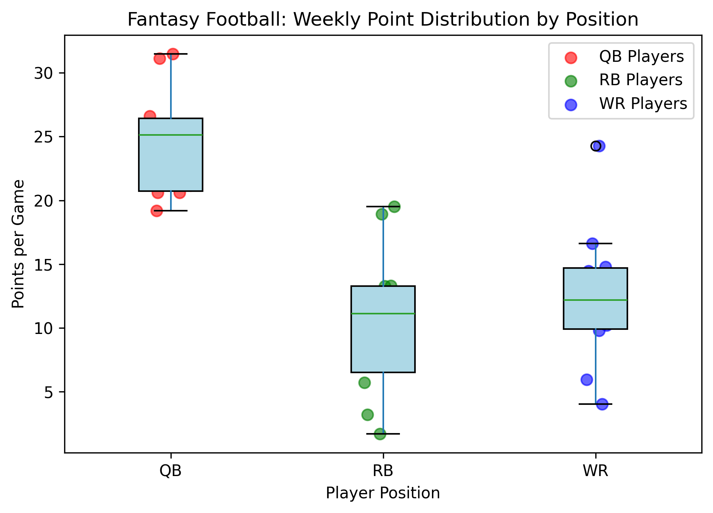

# Fantasy Football Points Simulation

This simulation models weekly fantasy points scored by QBs, RBs, and WRs using realistic distributions. Produces a boxplot showing position scoring trends and outliers.

### Features
- Simulates points with realistic averages & standard deviations
- Boxplot visualization for easy comparison

### Run it
- Run `fantasy_ff_sim.py` to create `fantasy_ff_boxplot.png`.

### Example Chart

